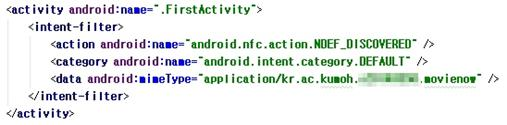

# 2017-Capstone-Design
* NFCWriter : NFC 기능 실험 시 태그에 Media 파일을 쓰기 위한 애플리케이션 소스 코드입니다<br>
* application : Movie Now 최종 소스 코드입니다.
* server : 서버에 저장되어 데이터베이스 접근, OPEN API 요청 및 가공, 푸시 알람 요청, 영화 추천 알고리즘 구동, 애플리케이션과의 통신에 사용된 코드입니다
# Summary
2017년 1학기 창의설계프로젝트를 통해 제작된 안드로이드 애플리케이션 Movie Now입니다. 이 애플리케이션은 사용자의 현재 위치에 기반한 영화 검색 애플리케이션입니다. 본 애플리케이션은 다음과 같은 기능이 구현되어 있습니다.

1. 회원 가입 / 로그인 / 회원 정보 수정 / 탈퇴 지원

2. 데이터 크롤링을 사용하여 현재 상영작 / 상영 예정작을 데이터베이스에 저장 및 표시

3. 사용자의 위치를 기반으로 한 영화관 / 상영시간표 표시

4. 영화 예매 및 영화관까지의 길 안내 (지도, AR)

5. 사용자의 선호 장르와 예매 기록을 기반으로 한 영화 추천

6. NFC 태깅을 이용해 영화관 입장 전/후 사용자의 스마트폰을 무음/소리로 전환

<image src="./image/전체 흐름도.jpg"><br>
## Function Done by Me
### <b>회원 가입 / 로그인 / 회원 정보 수정 / 탈퇴 지원</b><br>
영화 추천 기능과 푸시 알람을 사용하기 위해선 사용자의 회원 가입을 통한 정보 수집이 필요했으므로 회원 가입 페이지와 회원 정보 수정 페이지, 회원 탈퇴 페이지를 제작했습니다. 회원 가입 시 아이디 중복 확인, 비밀번호 재확인 기능을 구현하였고 추천 기능 사용 여부도 사용자가 선택할 수 있도록 해 불필요한 푸시 알람을 하지 않도록 도왔습니다. 또한 사용자의 선호 장르를 0점부터 10점까지 선택하게 하고 이를 데이터베이스에 저장했습니다. 이는 선호/비선호가 아닌 수치화된 데이터를 사용함으로써 더욱 정밀한 추천 알고리즘을 구현하기 위함입니다.<br>
애플리케이션을 껐다 켜거나, 심할 경우 강제 종료 및 스마트폰의 전원 on/off시에도 로그인이 유지되어야 사용자의 예매 기록을 수집할 수 있기 때문에 세션 유지를 중요하게 생각했습니다. 하지만 안드로이드 프로그래밍이 처음이었던 저는 어떻게 세션을 유지해야 할지에 대해 오랜 시간 고민했고, 결국 SharedPrefManager를 사용한 애플리케이션 자체에서의 세션 유지/관리 방법을 찾아 로그인 유지 문제를 해결할 수 있었습니다.<br>
추후에 사용자가 원할 경우 사용할 수 있도록 추천 기능 사용 여부와 선호 장르의 점수를 조정할 수 있는 회원 정보 수정 페이지와 회원 정보를 모두 삭제하고 탈퇴하는 회원 탈퇴 페이지도 구현했습니다. 회원 정보 수정과 탈퇴 이전에 비밀번호를 다시 입력하도록 해 사용자 본인임을 인증하는 기능도 구현하였습니다.<br>회원 가입 / 로그인 / 회원 정보 수정 / 회원 탈퇴를 통해 서버로 전달되는 데이터를 데이터베이스에 저장하거나 수정, 삭제하는 코드는 php로 구현하였습니다.<br>
<br>


### <b>사용자의 선호 장르와 예매 기록을 기반으로 한 영화 추천</b> <br>
이 애플리케이션은 영화진흥위원회 OPEN API를 사용하여 얻은 하루 전 박스오피스 순위와 사용자의 선호 장르 정보를 기반으로 매일 아침 오전 10시에 푸시 알람으로 사용자들에게 알맞은 추천 영화를 제공합니다. 이때 사용자의 선호 장르 정보는 회원 가입 시의 선호 장르에 대한 사용자의 평가(가중치), 그리고 영화 예매 버튼을 클릭할 때마다 해당 영화 장르의 가중치가 1씩 증가하는 것 두 개로 이루어져 있습니다.<br>
장르에 대한 선호도 계산은 다음과 같습니다
<code>선호도 = 선호 장르 수치 + (예매 횟수 x 2)</code>
추천 알고리즘은 매 사용자마다 다음과 같은 순서대로 동작합니다<br>

```
1. 1일 전 박스오피스 기록을 불러온다
2. 사용자의 목록을 불러온다
3. if(사용자가 추천 기능을 사용하지 않으면) continue
4. if(사용자가 현재 로그인상태가 아님) continue
5. 사용자의 영화 추천 내역을 저장
6. 박스오피스 목록에서 이미 추천한 영화를 제거하여 별도로 저장
7. if(박스오피스 목록의 모든 영화가 이미 추천된 영화일 경우)
	continue
8. 사용자의 선호장르와 예매기록을 각각 조회
9. 각 장르에 대한 가중치 계산 후 장르별 가중치 배열에 저장
10. 최종 계산된 가중치 배열을 가중치 기준으로 내림차순 정렬
11. 정렬된 가중치 배열에 대해 추천 기준을 넘어서는 장르를 별도로 추출하여 배열로 저장
12. if(추천 기준을 넘어서는 장르가 없음) continue
13. foreach (추천 기준을 넘어서는 모든 장르에 대해) {
  별도로 저장된 영화 목록에서 사용자에게 추천 할 장르의 영화가 있는지 검사
  if(추천할 장르의 영화가 하나도 없음) continue
  else {
    사용자에게 해당 영화의 이름과 장르를 푸시알림
	  해당 영화를 추천 내역에 저장
    break
  }
}
```

6번과 14번에 추천 내역이라는 개념이 등장합니다. 이는 박스오피스 순위에 등장하는 영화는 하루만 있는 것이 아니라 길게는 몇십 일씩 순위권에 있기 때문에 이를 고려하지 않을 경우 똑같은 영화가 매일 추천되는 문제가 발생하기 때문에 사용했습니다.<br>
이 과정을 거쳐 죄종적으로 선택된 영화의 장르와 영화명은 푸시 알람으로 전송됩니다. 이때 푸시 알람은 FCM을 사용하였습니다. FCM으로 코드를 짰을 때 푸시 알람으로 전송된 데이터에서 제목이 숫자로 표시되는 오류가 계속 발생했는데 구글 검색 결과 데이터 필드의 key 이름을 잘못 줘 발생한 오류임을 파악하고 수정해 올바르게 동작하도록 구현했습니다.


### <b>NFC 태깅을 사용한 무음 / 소리 변환 기능</b><br>

NFC 태깅은 가장 편하게 인텐트를 만들어 스마트폰의 기능을 제어하는 방법이라고 생각합니다. 저희는 영화 시작 시 스마트폰의 화면을 다시 켜 무음으로 바꾸고 끄는 행동은 다른 사람에게 방해가 될 뿐더러 귀찮기도 한 행동이라 생각했습니다. 그래서 스마트폰을 켜지 않고도 쉽게 태깅만으로 무음, 또는 소리로 바꿔주는 기능을 구현하였습니다.<br>
NFC의 데이터는 일반 텍스트 / Media / URL 세 가지로 구분되어 있으며 이 중 특정 앱을 실행시키는 데이터는 Media입니다. 그리고 특정 앱을 실행시키도록 하기 위해서는 특정 Media 데이터를 빈 NFC 태그에 넣어야 합니다.<br>
<br>
(상단의 application으로 시작하는 것이 Media 데이터를 구분하는 식별자이며 아래는 단순 데이터(Payload)입니다)<br>
이후 이 Media 데이터를 읽었을 때 Movie Now 애플리케이션이 실행되도록 Manifest 파일에 인텐트 필터를 추가합니다.<br>
<br>
이 인텐트 필터에 지정된 mimeType 값과 태그의 Media 데이터가 동일한 값이면 미리 오버라이딩한 onResume 함수가 실행됩니다.<br>
<br>
changeModeNormalSilent 함수의 코드는 다음과 같습니다<br>

```java
private void changeModeNormalSilent()
    {

        AudioManager am;
        am=(AudioManager) getBaseContext().getSystemService(Context.AUDIO_SERVICE);
        switch (am.getRingerMode())
        {
            //벨소리거나 무음 모드로 변환
            case AudioManager.RINGER_MODE_NORMAL:
                Toast.makeText(getApplicationContext(), "무음 모드로 변경되었습니다", Toast.LENGTH_SHORT).show();
                am.setRingerMode(AudioManager.RINGER_MODE_SILENT);
                break;
            case AudioManager.RINGER_MODE_SILENT:
                Toast.makeText(getApplicationContext(), "소리 모드로 변경되었습니다", Toast.LENGTH_SHORT).show();
                am.setRingerMode(AudioManager.RINGER_MODE_NORMAL);
                break;
        }
    }
```

### 서버 및 데이터베이스 자료 구조와 통신 환경 구축

이 모든 기능의 기본이 되는 서버와 데이터베이스 자료구조를 설계하고 통신 환경을 구축했습니다. 데이터베이스의 테이블들은 다음과 같으며, 자료구조는 server 폴더의 README.md를 참조해 주시길 바랍니다.<br>

```
1. 박스오피스 순위 (box_office)
2. 영화관의 정보 (m_theater)
3. 영화 정보 (movie_list)
4. 사용자의 선호 장르 정보 (preference_genre)
5. 사용자에게 추천한 영화 내역 (recommend_list)
6. 사용자의 예매 내역 (reserved_genre)
7. 영화 시간표 (timetable)
8. 사용자 정보 (user)
```
